# eCommerce: gameret

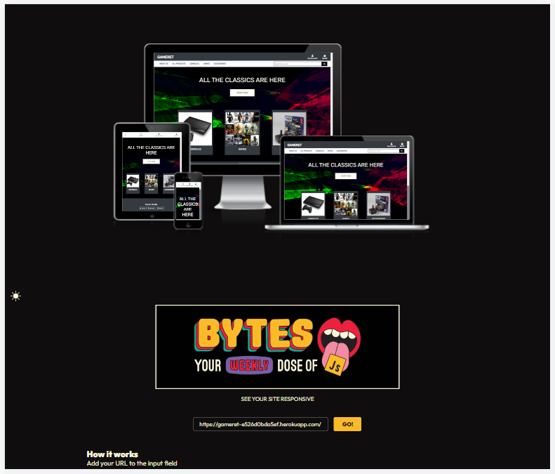

**Developer: James Lynch**

💻 [Visit live website](https://gameret-e526d0bda5ef.herokuapp.com/)  
(Ctrl + click to open in new tab)

## Table of Contents
  - [Executive Summary](#executive-summary)
     - [Market Analysis](#market-analysis)
     - [Marketing and Sales Strategy](#marketing-and-sales-strategy)
     - [Operations and Management](#operations-and-management)
     - [Financial Plan](#financial-plan)
     - [Conclusion](#conclusion)
  - [Marketing](#marketing)
     - [Social Media](#social-media)
     - [Mailing List](#mailing-list)
  - [User Goals](#user-goals)
  - [Site Owner Goals](#site-owner-goals)
  - [User Experience](#user-experience)
  - [User Stories](#user-stories)
  - [Wireframes](#wireframes)
  - [Design](#design)
    - [Colors](#colors)
    - [Fonts](#fonts)
    - [Structure](#structure)
      - [Website pages](#website-pages)
      - [AWS](#aws)
      - [Database](#database)
      - [Models](#models)
  - [Technologies Used](#technologies-used)
  - [Features](#features)
  - [Validation](#validation)
  - [Testing](#testing)
    - [Manual testing](#manual-testing)
    - [Automated testing](#automated-testing)
    - [Tests on various devices](#tests-on-various-devices)
    - [Browser compatibility](#browser-compatibility)
  - [Bugs](#bugs)
  - [Deployment](#deployment)
  - [Credits](#credits)
  - [Acknowledgements](#acknowledgements)

## Business Plan  
### Executive Summary:

Gameret is a web-based platform that video game lovers can view and purchase old and new products in the video game industry. It offers a convenient ecommerce shop with a easy-to-use platform for purchasing products as well as a contact page for inquiries and support.

Our target market is video game lovers of all ages. We aim to differentiate ourselves from competitors by offering a more easy to use and intuitive platform, as well varied scale of products.

Overall, Gsmeret aims to become the go-to destination for gamers looking to purchase video game products, as well as a trusted and reliable platform to use.

### Market Analysis:

The gaming industry is a multi-billion euro industry, with a large and dedicated consumer base. While traditional methods of purchasing video game related items (such as travelling to shop to see what is offered in-person) are still popular, there is a growing trend towards online ecommerce platforms. This shift towards online ecommerce presents a significant opportunity for Gameret to establish itself as a leading player in the market.

In terms of competition, Gameret will face other online ecommerce platforms as well as traditional methods of purchasing. However, we believe that our user-friendly platform and wide range of products in our ecommerce shop will differentiate us from competitors and make us a preferred choice for gamers.

In terms of target market, our primary focus will be video game lovers of all ages. We will also target collectors and online groups as potential customers for our software, as these organizations are constantly seeking rare and collectable pieces.

### Marketing and Sales Strategy:

Gameret will utilize a combination of online and offline marketing tactics to reach our target market. These tactics will include:

Online advertising through Google AdWords and social media platforms such as Facebook and Instagram
Content marketing through our blog and email newsletter
Partnerships and sponsorships with video-game related brands
Public relations efforts to generate press coverage and raise awareness of Gameret

### Operations and Management:

Gameret will be operated and managed by a small team of experienced professionals. The team will consist of a CEO, CTO, and marketing and sales staff.

In terms of operations, we will utilize a cloud-based platform to host the website and software, as well as a payment gateway for processing transactions. We will also utilize third-party fulfillment centers to handle the storage, packing, and shipping of products purchased through our ecommerce shop.

#### Financial Plan:

Gameret will generate revenue through the sale of products in our ecommerce shop. In terms of expenses, the main cost will be marketing and advertising efforts to drive traffic to the website and attract customers. We will also incur expenses related to the development.

In terms of financing, Gameret will initially be funded through a combination of personal investment and a small seed round of funding. As the business grows, we will explore additional funding options such as venture capital or a larger round of financing.

In terms of projections, we anticipate strong growth in both revenue streams over the first few years of operation. In the first year, we expect to generate €100,000 in revenue coming from product sales. In the second year, we expect to see revenue increase to €200,000 coming from product sales. By the third year, we anticipate revenue to reach €300,000 coming from software sales.

In terms of profitability, we expect to break even within the first year of operation and achieve profitability in the second year.

### Conclusion:

Gameret is a unique and innovative platform that aims to connect gamers with new and rare items, while also offering a convenient and user-friendly platform for purchasing video game related products. With strong growth potential and a clear revenue model, we believe that Gameret has the potential to become a leading player in the golf industry.
##### Back to [top](#table-of-contents)

## Marketing  

### Social Media  
The web app "Gameret" has a presence on both Facebook. The Facebook page serves as a platform to promote upcoming events, post updates on the latest features, and share user-generated content. This social media account allow users to stay informed and connected with the "Gameret" community.

[Facebook Mockup](docs/facebook/facebook_wireframe.png)  
[Facebook Suspended Account](docs/facebook/facebook_suspend.PNG)

### Mailing List  

Gameret uses Mailchimp to manage its mailing list. By joining the mailing list, users will receive updates on new features, upcoming events, and exclusive promotions. The process to join the mailing list is simple, users just need to provide their email address on the website, and they will start receiving email updates. Mailchimp allows the "gameret" team to segment the mailing list, personalize emails and track the success of email campaigns. By joining the mailing list, users will stay informed and be the first to know about new developments in the "gameret" web app.  

See Image

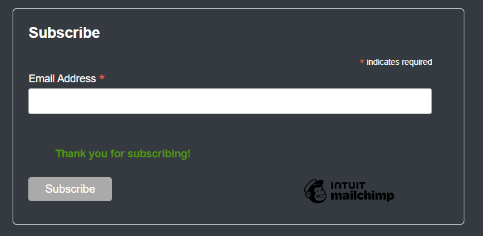  

 

## User Goals

- To easily and conveniently purchase games, consoles and console accessories 
- To browse and purchase a wide range of gaming products through the eCommerce shop
- To access the latest news and tips on gaming through various social media links
- To contact the Gameret team with any inquiries or support needs through the contact page

## Site Owner Goals

- Generate revenue through the sale of products in the ecommerce shop
- Build a strong and loyal customer base by providing an easy-to-use platform and high-quality products
- Establish Gameret as a trusted and respected brand in the gaming industry
- Achieve profitability and sustain long-term growth

## User Experience

### Target Audience
- Gaming enthusiasts who are interested in gaming related products.
- Gaming Collecters who look to find rare or valuable piceses.
- Individuals who are looking for information and resources related to speicic gaming products.
- Any individual who is interested in purchasing gaming related products through the app's ecommerce shop.

### User Requirements and Expectations

- Good customer service
- A user-friendly interface
- Fully responsive
- Accessible
- A welcoming design
- Contact information
- Accessibility
- Competitive prices
- Social media

##### Back to [top](#table-of-contents)

## User Stories

| User Story ID                  | As A/AN             | I CAN...                                                | SO THAT I CAN...                                          |
|--------------------------------|---------------------|---------------------------------------------------------|-----------------------------------------------------------|
| Registration and User Accounts ||||
| 1 | Shopper / Site User | register for an account | have an account and view my profile |
| 2 | Shopper / Site User | login and logout | have an account with my information stored for fast usage |
| 3 | Shopper / Site User | recover my password | set a new password if I forgot it                         |
| 4 | Shopper / Site User | receive an email confirmation after registration| be notified registration was successful                   |
| 5 | Shopper / Site User | have a profile | store my information for faster checkouts in the future |
| Viewing and navigation ||||
| 6 | Shopper / Site User | navigate across the site | can access all parts of the site                          |
| 7 | Shopper / Site User | use a navbar, footer, and social icons | navigate the site, access menus, and access socials       |
| 8 | Shopper / Site User | be notified of my actions | be aware the action was completed successfully or not     |
| 9 | Shopper / Site User | see my login status | know if I am logged in or not |
| 10 | Shopper / Site User | visit the shop| view all products available |
| 11 | Shopper / Site User | view my basket and total cost at any time | so I am aware of what I am buying and it's cost |
| 12 | Shopper / Site User | view a list of products | select a product to purchase                              |
| 13 | Shopper / Site User | view an individual product details | view a more detailed view of the product |
| 14 | Shopper / Site User | view a list of consoles | select a console I want to purchase |
| 15 | Shopper / Site User | view a list of games | select a game I want to purchase |
| 16 | Shopper / Site User | view a list of accessories | select an accessory I want to purchase |
| Sorting and Searching ||||
| 17 | Shopper / Site User | view individual consoles | see more detailed information about it |
| 18 | Shopper / Site User | view individual games | see more detailed information about it |
| 19 | Shopper / Site User | view individual accessories | see more detailed information about it |
| 20 | Shopper / Site User | search for a product by name or description | find a certain product                                    |
| 21 | Shopper / Site User | see my search results | only see what I am searching for |
| 22 | Shopper / Site User | sort by price low to high and high to low | view products according to my budget |
| 23 | Shopper / Site User | Sort products in alphabetical order | search products by letter |
| Purchasing and Checkout ||||
| 24 | Shopper / Site User | use a card as the payment method | complete my purchase                                      |
| 25 | Shopper / Site User | select the quantity of a product | select a quantity that suites my needs |
| 26 | Shopper / Site User | view items in my basket | be aware of what I am buying and it's cost |
| 27 | Shopper / Site User | adjust item quantity in my basket | increase or reduce item count according to my needs |
| 28 | Shopper / Site User | receive order confirmation | be notified of a successful order |
| 29 | Shopper / Site User | receive email confirmation | have a record of my purchase |
| 30 | Shopper / Site User | subscribe to a newsletter | Keep updated with the latest new from the store |
| Admin and Store Management | | | |
| 31 | Store Owner / Admin | add a product | add new products to the shop |
| 32 | Store Owner / Admin | edit a product | edit existing products in the shop |
| 33 | Store Owner / Admin | delete a product | delete existing products from the shop |
| 34 | Store Owner / Admin | view messages sent in by public | gather feedback and converse its with its community|

### Kanban, Epics & User Stories
- GitHub Kanban was used to track all open user stories
- The Milestones feature was used to create Epics
- Todo, In Progress, Done headings were used in the kanban

Epic Overview

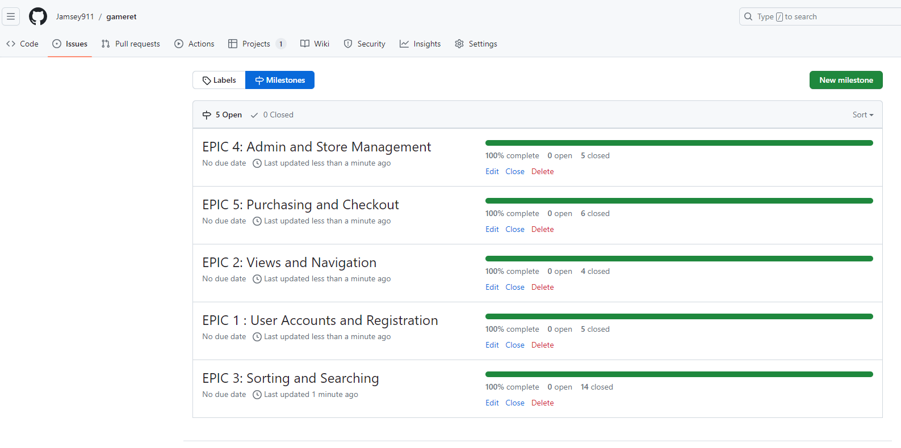

Epic 1

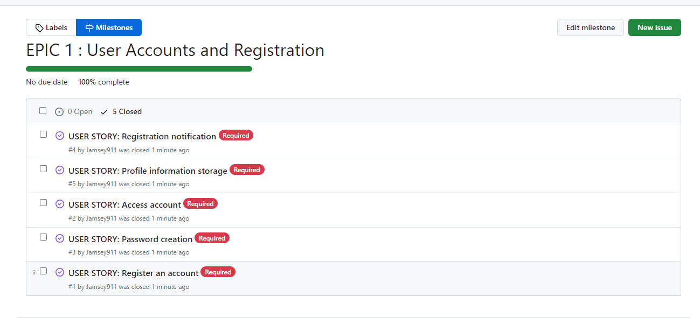

Epic 2

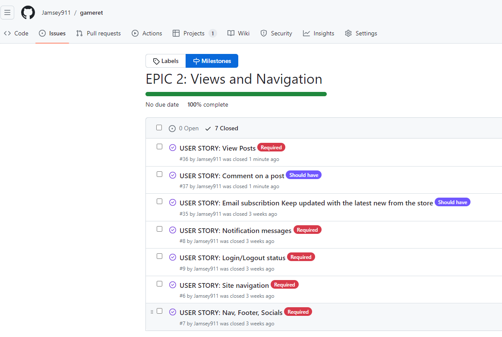

Epic 3

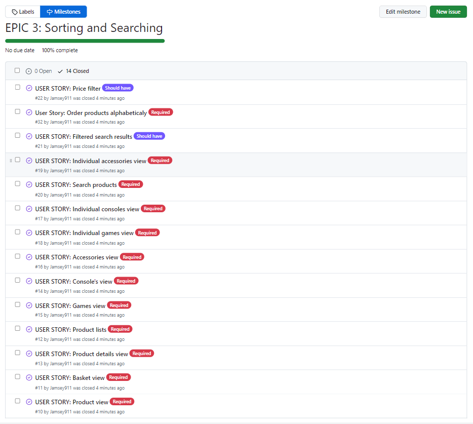

Epic 4

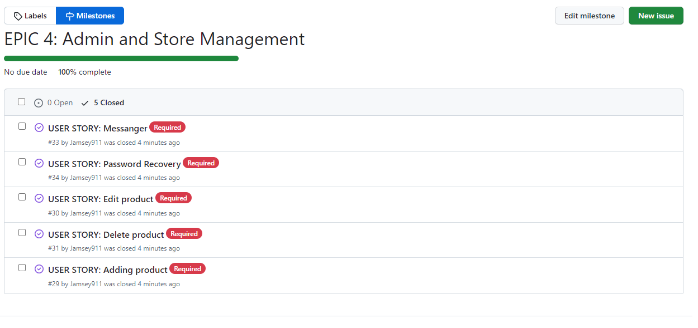

Epic 5

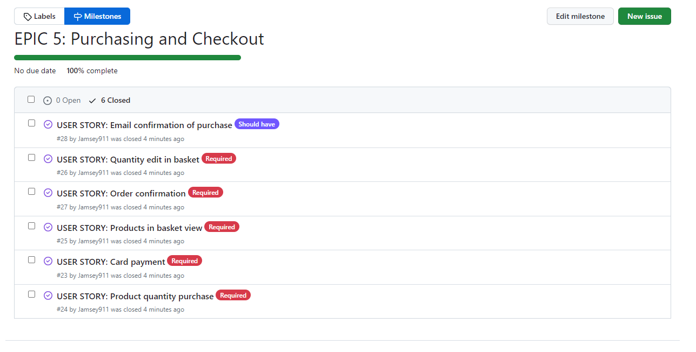

User Stories

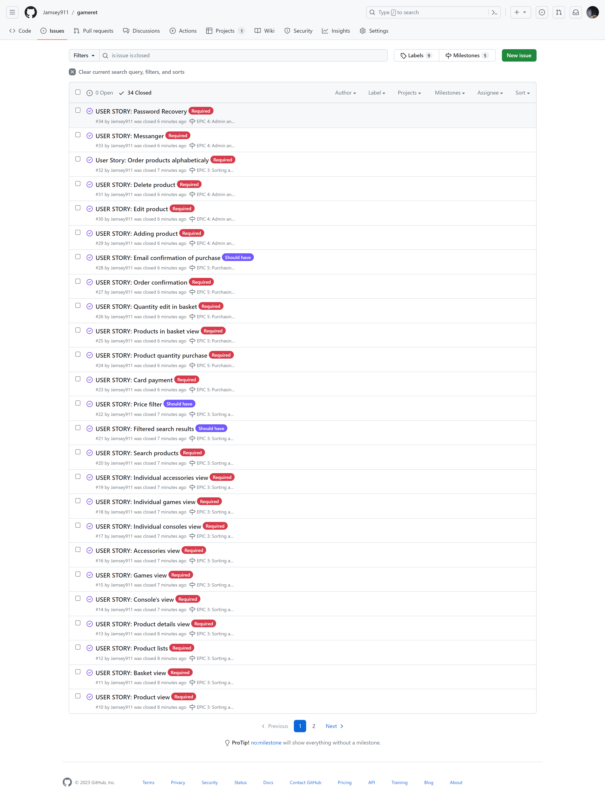
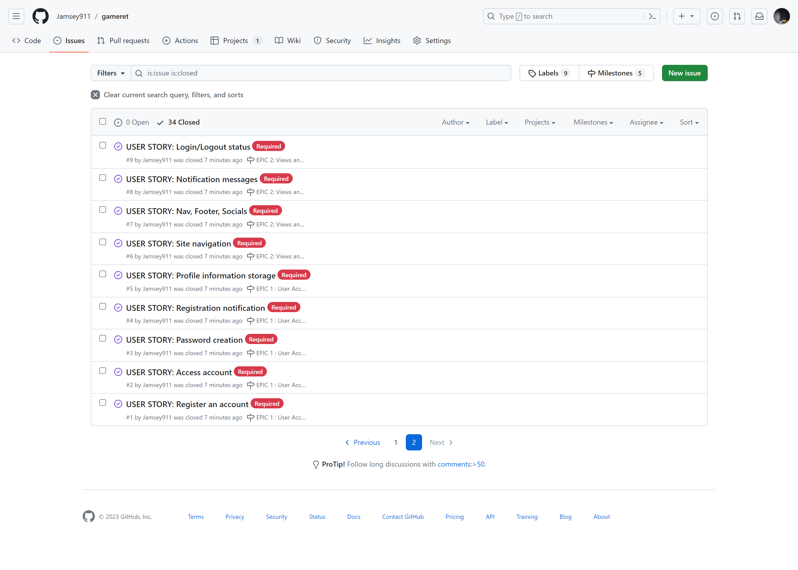

Kanban

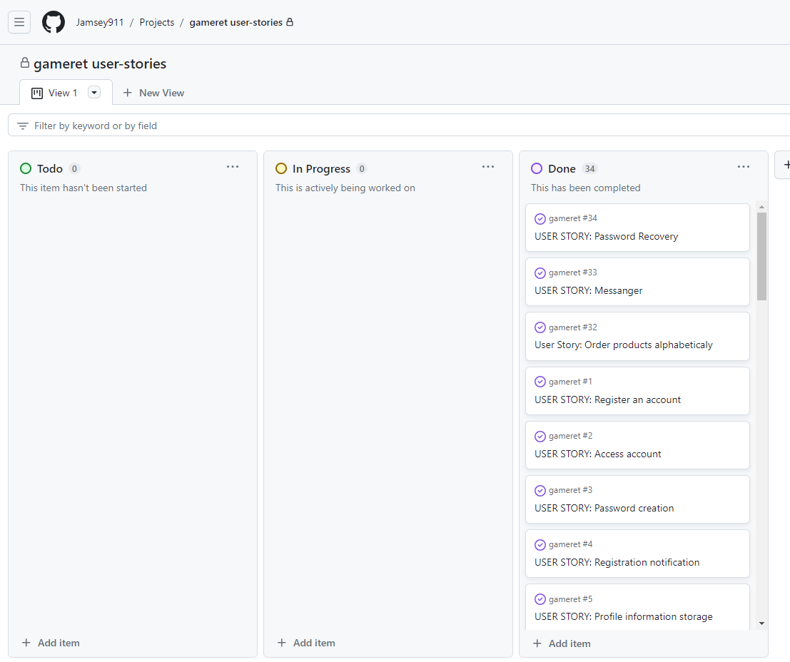

##### Back to [top](#table-of-contents)

<!-- ## Wireframes
I used Balsamiq to create wireframes for my project. It's a user-friendly wireframing tool that enables me to quickly and easily create mockups for my website or application. It offers a wide range of pre-built UI elements, and allows for easy collaboration with my team. I linked a pdf of my wireframes, which you can access it and check it out the design, layout and the flow of the project before implementing it in the real product.  

<a href="https://github.com/ArronBeale/CI_PP5_tee_time/raw/main/docs/wireframes/wireframes-teetime.pdf" target="_blank">Download Wireframes PDF</a>  
(Ctrl + click to open in new tab)  

Wireframe Home
  

Wireframe Profile
  

Wireframe Clubs
  

Wireframe Club Detail
  

Wireframe Shop
  

  

Wireframe Product Detail
  

 

Wireframe Checkout
  

  

 -->

## Design

### Colors

The colour sheme was chosen as a dark grey and black theme in which i was aided by Adobe Color by using their Split Complementary Color feature. A simple grey and egg-shell white was used to give it contrast which was selected also through adobe color. A slighly dark grey was selected for certain elements in the events page.  

See Color Palette

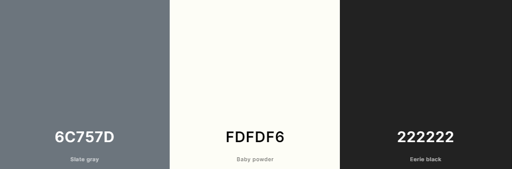

### Fonts

 The font selected was from Google Fonts, Roboto.

 

See Font Image

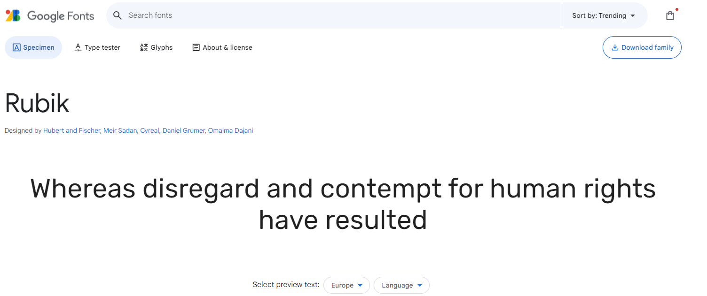

# Structure

The home page is designed to have all relevanet information easily accessible with all relevent navigation clearly visible. The logo is postioned on the left with the bag information to the right. The search navigation information is postioned just below the logo and bag information centrally and this is shown on all pages in the same layout. The design is created also to be responsive on all viewports while maintaing all relevant information:

## Website pages

- The site consists of the following pages:
  - Home
  - Product List
  - Edit product
  - Delete product
  - Product Expanded
  - Basket
  - Checkout
  - Checkout Success
  - About
  - Register
  - Profile
  - Login
  - Logout
  - Reset Password
  - Register
  - 404
  - 500

  ##### Back to [top](#table-of-contents)
  

## AWS 

AWS (Amazon Web Services) was utilized in this project for hosting image files. An S3 bucket on AWS was created to store and serve the project's images, providing a reliable and scalable solution for managing and delivering the visual assets. With AWS, the project benefits from secure and efficient storage capabilities, ensuring seamless access to images throughout the application.

AWS Image

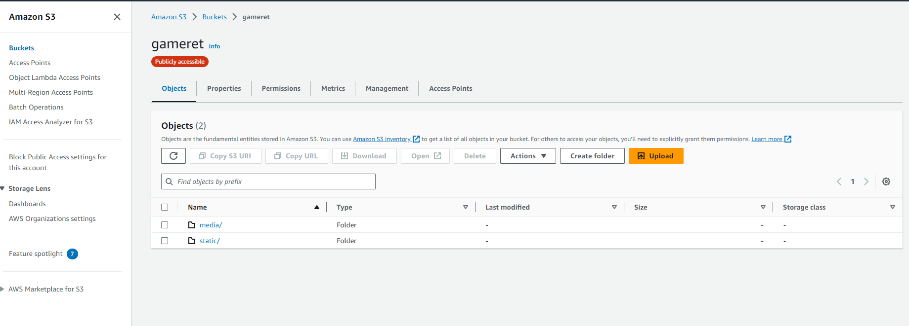

## Database

I built my database using PostgreSQL. It's a powerful and open-source object-relational database system that is known for its reliability, robustness, and performance. I chose it because it provides a flexible tool for efficiently managing and organizing my data.

Database Schema

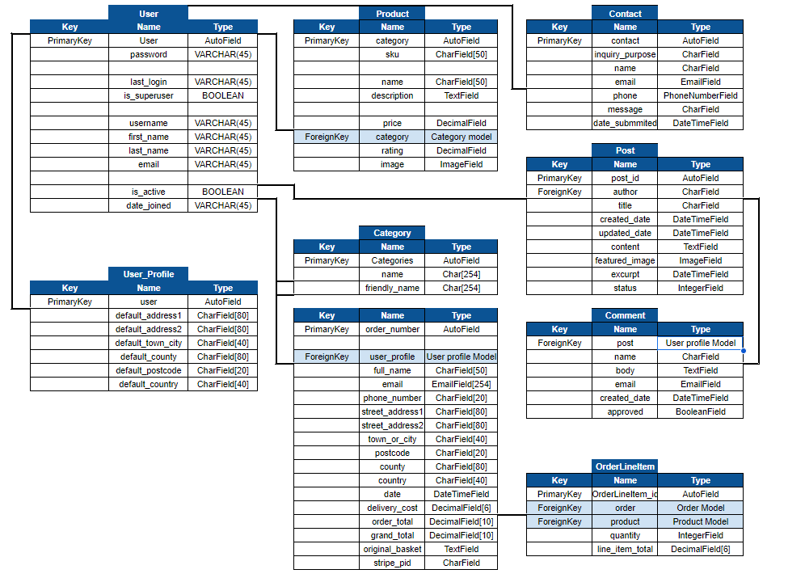

## Models  

### User Model

| Key        | Name         | Type        |
| ---------- | ------------ | ----------- |
| PrimaryKey | User         | AutoField   |
|            | password     | VARCHAR(45) |
|            | last_login   | VARCHAR(45) |
|            | is_superuser | BOOLEAN     |
|            | username     | VARCHAR(45) |
|            | first_name   | VARCHAR(45) |
|            | last_name    | VARCHAR(45) |
|            | email        | VARCHAR(45) |
|            | is_staff     | BOOLEAN     |
|            | is_active    | BOOLEAN     |
|            | date_joined  | VARCHAR(45) |

### User Profile Model

| Key        | Name                 | Type          |
| ---------- | -------------------- | ------------- |
| PrimaryKey | User                 | AutoField     |
|            | default_phone_number | CharField[20] |
|            | default_address1     | CharField[80] |
|            | default_address2     | CharField[80] |
|            | default_town_city    | CharField[40] |
|            | default_county       | CharField[80] |
|            | default_postcode     | CharField[20] |
|            | default_country      | CharField[40] |

### Product Model

| Key        | Name        | Type           |
| ---------- | ----------- | -------------- |
| PrimaryKey | category    | AutoField      |
|            | sku         | CharField[50]  |
|            | name        | CharField[50]  |
|            | description | TextField      |
|            | price       | DecimalField   |
| ForeignKey | category    | Category model |
|            | rating      | DecimalField   |
|            | image       | ImageField     |
|            | image_url   | CharField[1024]|

### Category Model  

| Key        | Name          | Type      |
| ---------- | ------------- | --------- |
| PrimaryKey | category_id   | AutoField |
|            | name          | Char[254] |
|            | friendly_name | Char[254] |

### Order Model  

| Key        | Name            | Type               |
| ---------- | --------------- | ------------------ |
| PrimaryKey | order_number        | AutoField      |
| ForeignKey | user_profile    | User profile Model |
|            | full_name       | CharField[50]      |
|            | email           | EmailField[254]    |
|            | phone_number    | CharField[20]      |
|            | address1        | CharField[80]      |
|            | address2        | CharField[80]      |
|            | town_city       | CharField[40]      |
|            | postcode        | CharField[20]      |
|            | county          | CharField[80]      |
|            | country         | CharField[40]      |
|            | date            | DateTimeField      |
|            | delivery_cost   | DecimalField[6]    |
|            | order_total     | DecimalField[10]   |
|            | grand_total     | DecimalField[10]   |
|            | original_basket | TextField          |
|            | stripe_pid      | CharField          |

### OrderLineItem Model  

| Key        | Name             | Type            |
| ---------- | ---------------- | --------------- |
| PrimaryKey | OrderLineItem_id | AutoField       |
| ForeignKey | order            | Order Model     |
| ForeignKey | product          | Product Model   |
|            | quantity         | IntegerField    |
|            | line_item_total  | DecimalField[6] |

### ContactUs Model

| Key        | Name         | Type             |
| ---------- | ------------ | ---------------- |
| PrimaryKey | contact      | AutoField        |
|            | inquiry_pur..| DateTimeField    |
|            | name         | CharField        |
|            | email        | EmailField       |
|            | phone        | PhoneNumberField |
|            | message      | TextField        |  
|            | date_submm.. | DateTimeField    | 

##### Back to [top](#table-of-contents)

## Technologies Used

### Languages & Frameworks

- HTML
- CSS
- Javascript
- Python
- Django

### Libraries & Tools

- [Am I Responsive](http://ami.responsivedesign.is/)
- [Balsamiq](https://balsamiq.com/)
- [Bootstrap v5.2](https://getbootstrap.com/)
- [Cloudinary](https://cloudinary.com/)
- [Favicon.io](https://favicon.io)
- [Chrome dev tools](https://developers.google.com/web/tools/chrome-devtools/)
- [Font Awesome](https://fontawesome.com/)
- [Git](https://git-scm.com/)
- [GitHub](https://github.com/)
- [Google Fonts](https://fonts.google.com/)
- [Heroku Platform](https://id.heroku.com/login)
- [AWS](https://aws.amazon.com/)
- [jQuery](https://jquery.com)
- [Postgres](https://www.postgresql.org/)
- [Summernote](https://summernote.org/)
- Validation:
  - [WC3 Validator](https://validator.w3.org/)
  - [Jigsaw W3 Validator](https://jigsaw.w3.org/css-validator/)
  - [JShint](https://jshint.com/)
  - [CI Python Liner(PEP8)](https://pep8ci.herokuapp.com/)
  - [Lighthouse](https://developers.google.com/web/tools/lighthouse/)
  - [Wave Validator](https://wave.webaim.org/)

## Features  

### Search Engine Optimisation (SEO)
I have used meta tags in the HTML of my web app's pages to optimize them for search engines. The description tag provides a brief summary of the content on the page, while the keywords tag lists relevant keywords to help search engines understand the content of the webpage and its relevance to related search queries.

See feature image

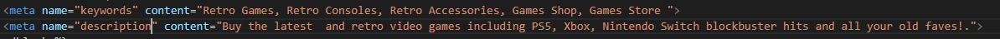

  

### Home page
- Home page includes nav bar, main body and a footer.

See feature images

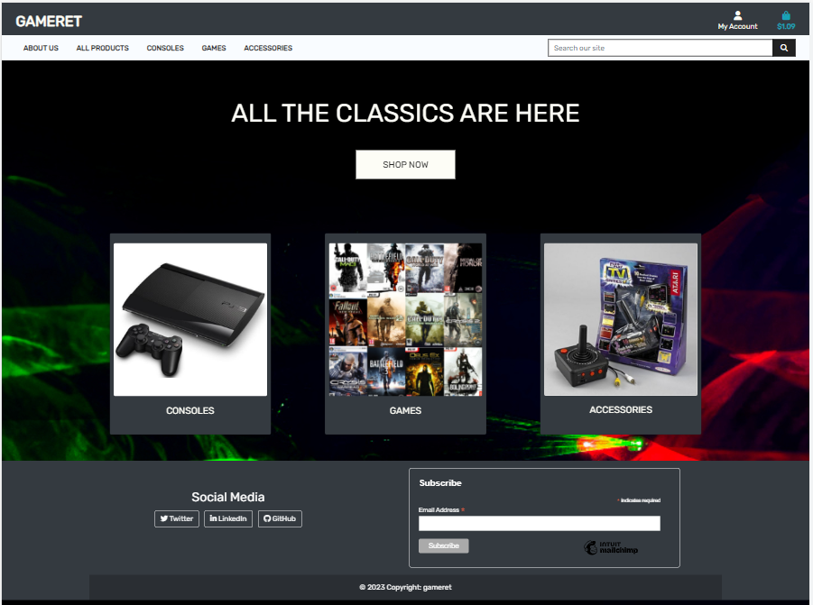

  

### Logo
- A custom logo for the business.
- User stories covered: 6, 7

See feature images

  

### Navigation
- Fully Responsive.
- On small screens switches to hamburger menu.
- Indicates login/logout in status.
- displayed on all pages.  
- User stories covered: 6, 7

See feature images

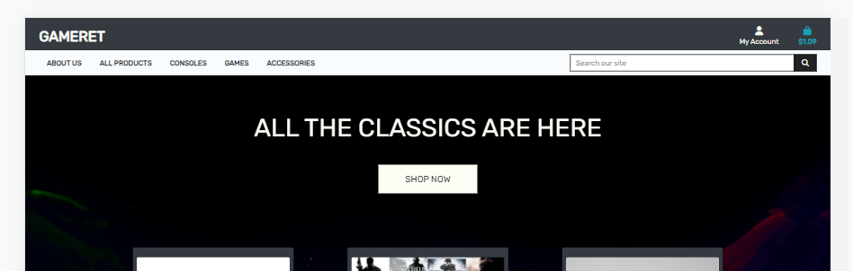

### Card Links
- Allows the user to easy access filters  
- User stories covered: 6, 12, 14, 15, 16

See feature image

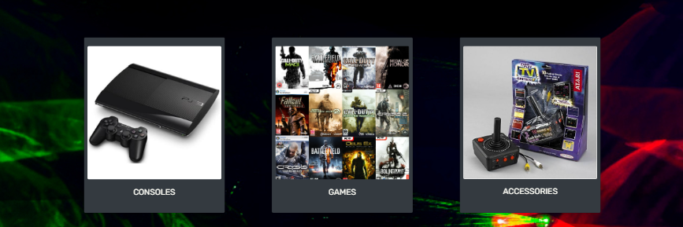

### Footer
- Contains social media links, privacy policy, and copyright.
- displayed on home page and about page 
- User stories covered: 6, 7

See feature images

  

### Mailing List Sign Up
- Mailchimp signup for email mailing list.  
- User stories covered: 30

See feature images

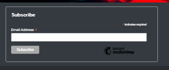

### Social Media Links
- An icon with a link is used for each social media displayed
- Each link opens in a new tab so the user has access to the website after being redirected
- displayed on home page and about page 
- User stories covered: 7

See feature images

### Sign up / Register
- Allow users to register an acoount.
- User stories covered: 1  

See feature image

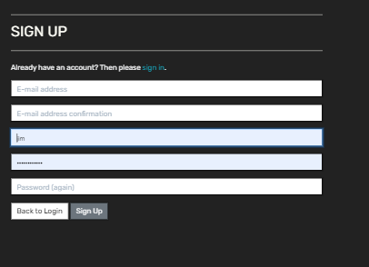

### Sign In
- User can sign in.  
- User stories covered: 2

See feature images

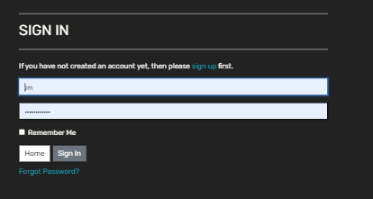

### Sign Out
- Allows the user to securely sign out.
- Ask user if they are sure they want to sign out.  
- User stories covered: 2

See feature image

  

### Products View
- Allows the user to view all listed products. 
- User stories covered: 12, 14, 15, 16

See feature image

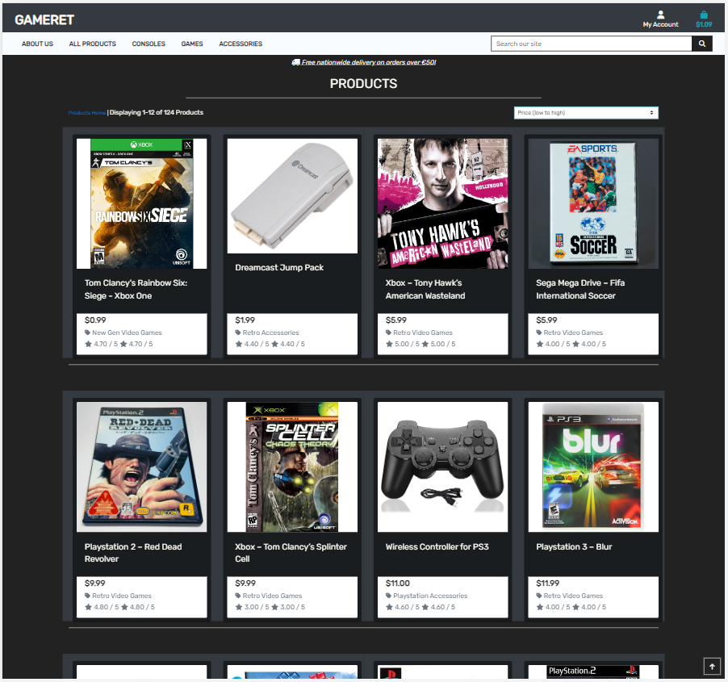

### Products detail 
- Allows the user to view details of a specific product. 
- User stories covered: 13, 17, 18, 19

See feature images

### Bag
- Allows the user to view the basket with their items. 
- User stories covered: 11, 26

See feature image

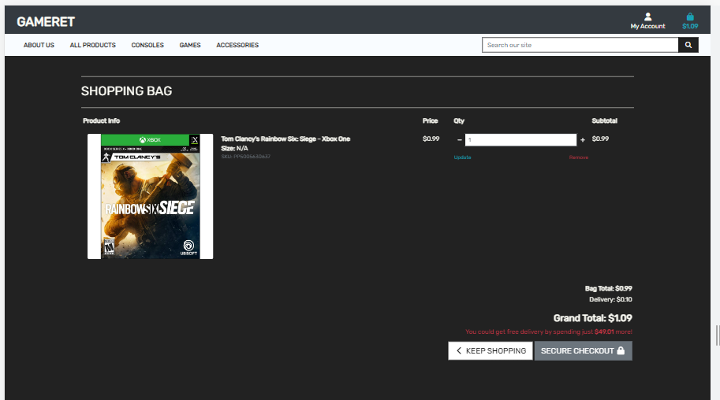

  

### Checkout View
- Allows user to purchase products.  
- User stories covered: 24

See feature image

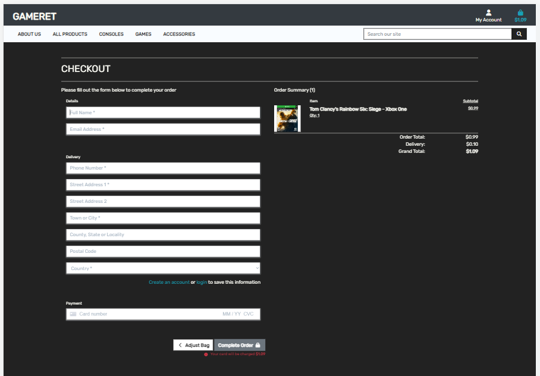

 

### Edit Product Quantity
- Allows the user to edit their bookings.  
- User stories covered: 25, 27

See feature image

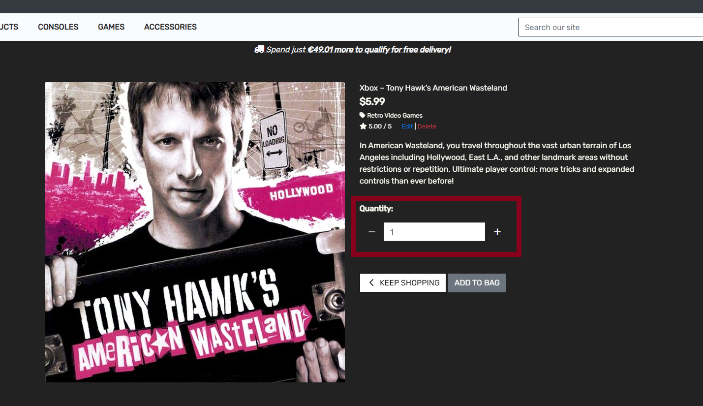
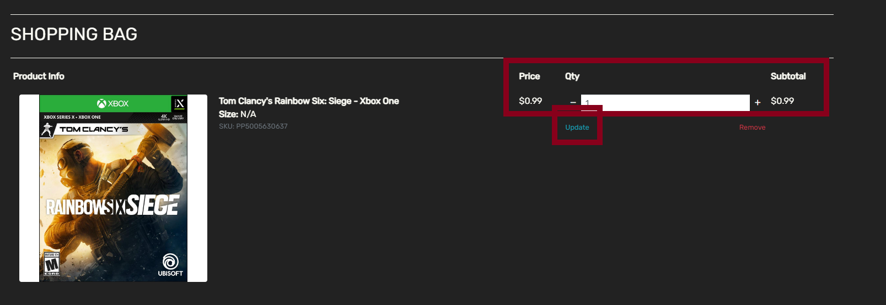

  

### Delete Product From Bag
- Allows the user to cancel their bookings.  
- User stories covered: 25, 27

See feature image

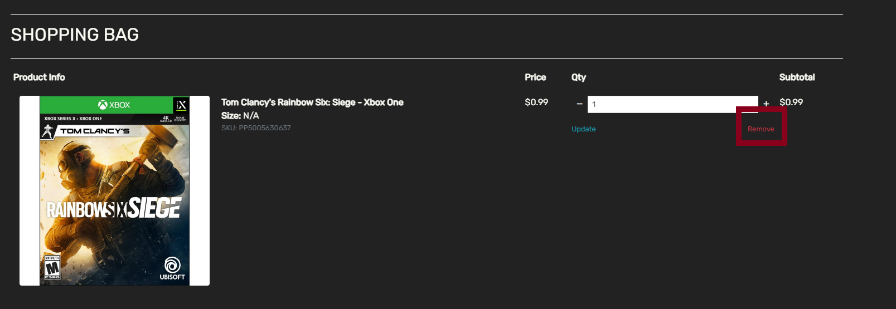

  

### Alert Box
- Allows the user to see relevant alerts.  
- User stories covered: 26

See feature image

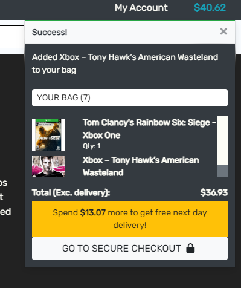

   

### Sort
- Allows the user to sort the listed products.  
- User stories covered: 20, 21, 22, 23   

See feature images

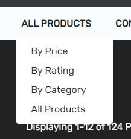
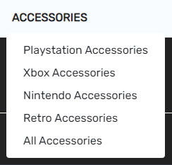

  

### Search
- Allows the user to search for products.  
- User stories covered: 21

See feature image

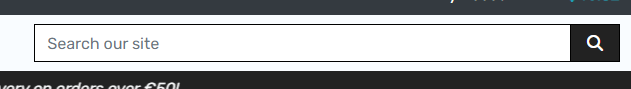

  

### Stripe
- Allows the user to use stripe for card payments.  
- User stories covered: 24

See feature image

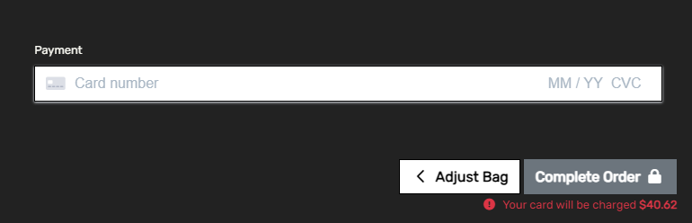

 

### Confirmation Details
- Allows the user to receive confirmation of purchase
- Full details are shown along with a message  
- User stories covered: 28

See feature image

  

### Email Confirmation
- Allows the user to receive an email confirmation for their order.  
- User stories covered: 29

See feature image

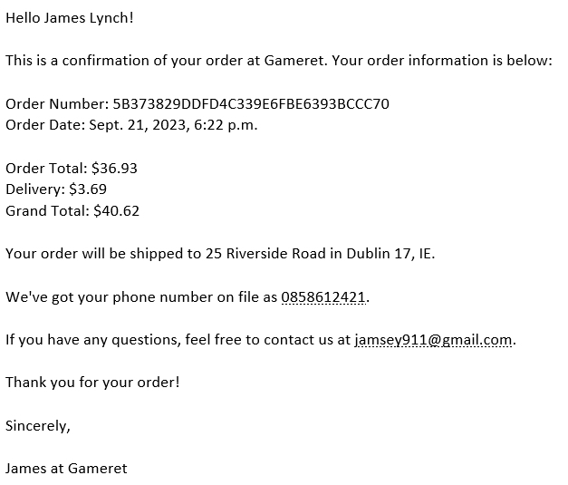

  

### Profile
- Allows the user to update their information and see their order history.  
- User stories covered: 5

See feature image

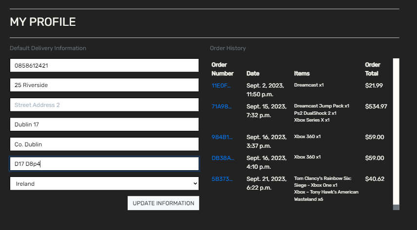

  

### Add Product
- Allows the Admin to add new products.  
- User stories covered: 30

See feature image

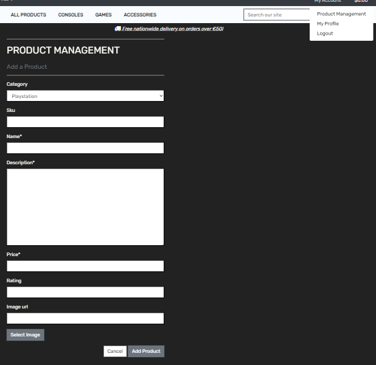

  

### Edit Product
- Allows the user to edit the products.  
- User stories covered: 31

See feature image

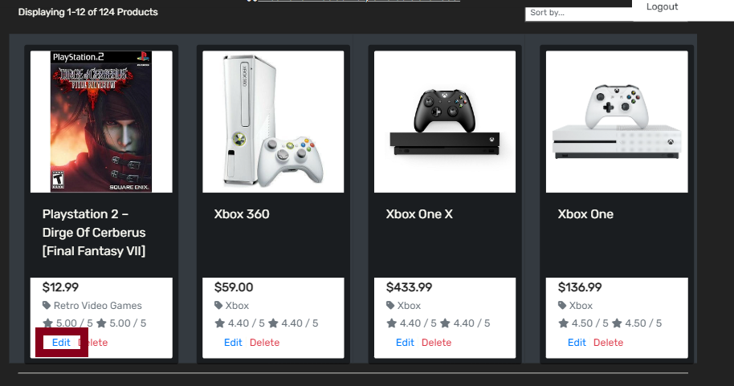

  

### Delete Product
- Allows the user to delete products, includes confirmation prompt before deletion.  
- User stories covered: 32

See feature image

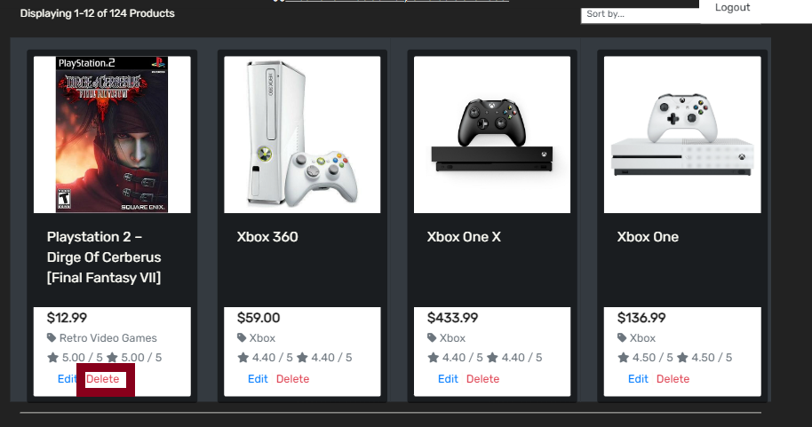

  

### Contact message
- Users can send a message via the message form 
- User stories covered: 33 
  

See feature images

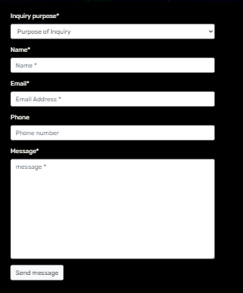

### Pagination
- Pagination is used on the products page
- Pagination is included in filtered and query search's 
- User stories covered: 6
  

See feature images

##### Back to [top](#table-of-contents)

