# eCommerce: gameret

**Developer: James Lynch**

💻 [Visit live website](https://gameret-e526d0bda5ef.herokuapp.com/)  
(Ctrl + click to open in new tab)

## Table of Contents
  - [Executive Summary](#executive-summary)
     - [Market Analysis](#market-analysis)
     - [Marketing and Sales Strategy](#marketing-and-sales-strategy)
     - [Operations and Management](#operations-and-management)
     - [Financial Plan](#financial-plan)
     - [Conclusion](#conclusion)
  - [Marketing](#marketing)
     - [Social Media](#social-media)
     - [Mailing List](#mailing-list)
  - [User Goals](#user-goals)
  - [Site Owner Goals](#site-owner-goals)
  - [User Experience](#user-experience)
  - [User Stories](#user-stories)
  - [Wireframes](#wireframes)
  - [Design](#design)
    - [Colors](#colors)
    - [Fonts](#fonts)
    - [Structure](#structure)
      - [Website pages](#website-pages)
      - [AWS](#aws)
      - [Database](#database)
      - [Models](#models)
  - [Technologies Used](#technologies-used)
  - [Features](#features)
  - [Validation](#validation)
  - [Testing](#testing)
    - [Manual testing](#manual-testing)
    - [Automated testing](#automated-testing)
    - [Device Testing](#device-testing)
    - [Browser Compatibility](#browser-compatibility)
  - [Bugs](#bugs)
  - [Deployment](#deployment)
  - [Credits](#credits)
  - [Acknowledgements](#acknowledgements)

## Business Plan  
### Executive Summary:

Gameret is a web-based platform that video game lovers can view and purchase old and new products in the video game industry. It offers a convenient ecommerce shop with a easy-to-use platform for purchasing products as well as a contact page for inquiries and support.

Our target market is video game lovers of all ages. We aim to differentiate ourselves from competitors by offering a more easy to use and intuitive platform, as well varied scale of products.

Overall, Gameret aims to become the go-to destination for gamers looking to purchase video game products, as well as a trusted and reliable platform to use.

### Market Analysis:

The gaming industry is a multi-billion euro industry, with a large and dedicated consumer base. While traditional methods of purchasing video game related items (such as travelling to shop to see what is offered in-person) are still popular, there is a growing trend towards online ecommerce platforms. This shift towards online ecommerce presents a significant opportunity for Gameret to establish itself as a leading player in the market.

In terms of competition, Gameret will face other online ecommerce platforms as well as traditional methods of purchasing. However, we believe that our user-friendly platform and wide range of products in our ecommerce shop will differentiate us from competitors and make us a preferred choice for gamers.

In terms of target market, our primary focus will be video game lovers of all ages. We will also target collectors and online groups as potential customers for our software, as these organizations are constantly seeking rare and collectable pieces.

### Marketing and Sales Strategy:

Gameret will utilize a combination of online and offline marketing tactics to reach our target market. These tactics will include:

Online advertising through Google AdWords and social media platforms such as Facebook and Instagram
Content marketing through our blog and email newsletter
Partnerships and sponsorships with video-game related brands
Public relations efforts to generate press coverage and raise awareness of Gameret

### Operations and Management:

Gameret will be operated and managed by a small team of experienced professionals. The team will consist of a CEO, CTO, and marketing and sales staff.

In terms of operations, we will utilize a cloud-based platform to host the website and software, as well as a payment gateway for processing transactions. We will also utilize third-party fulfillment centers to handle the storage, packing, and shipping of products purchased through our ecommerce shop.

#### Financial Plan:

Gameret will generate revenue through the sale of products in our ecommerce shop. In terms of expenses, the main cost will be marketing and advertising efforts to drive traffic to the website and attract customers. We will also incur expenses related to the development.

In terms of financing, Gameret will initially be funded through a combination of personal investment and a small seed round of funding. As the business grows, we will explore additional funding options such as venture capital or a larger round of financing.

In terms of projections, we anticipate strong growth in revenue streams over the first few years of operation. In the first year, we expect to generate €100,000 in revenue coming from product sales. In the second year, we expect to see revenue increase to €200,000 coming from product sales. By the third year, we anticipate revenue to reach €300,000 coming from software sales.

In terms of profitability, we expect to break even within the first year of operation and achieve profitability in the second year.

### Conclusion:

Gameret is a unique and innovative platform that aims to connect gamers with new and rare items, while also offering a convenient and user-friendly platform for purchasing video game related products. With strong growth potential and a clear revenue model, we believe that Gameret has the potential to become a leading player in the gaming industry.
##### Back to [top](#table-of-contents)

## Marketing  

### Social Media  
The web app "Gameret" has a presence on Facebook. The Facebook page serves as a platform to promote upcoming events, post updates on the latest features, and share user-generated content. This social media account allow users to stay informed and connected with the "Gameret" community.

[Facebook Mockup](docs/facebook/facebook_wireframe.png)  
[Facebook Suspended Account](docs/facebook/facebook_suspend.PNG)

### Mailing List  

Gameret uses Mailchimp to manage its mailing list. By joining the mailing list, users will receive updates on new features, upcoming events, and exclusive promotions. The process to join the mailing list is simple, users just need to provide their email address on the website, and they will start receiving email updates. Mailchimp allows the "gameret" team to segment the mailing list, personalize emails and track the success of email campaigns. By joining the mailing list, users will stay informed and be the first to know about new developments in the "gameret" web app.  

See Image

  

 

## User Goals

- To easily and conveniently purchase games, consoles and console accessories 
- To browse and purchase a wide range of gaming products through the eCommerce shop
- To access the latest news and tips on gaming through various social media links
- To contact the Gameret team with any inquiries or support needs through the contact page

## Site Owner Goals

- Generate revenue through the sale of products in the ecommerce shop
- Build a strong and loyal customer base by providing an easy-to-use platform and high-quality products
- Establish Gameret as a trusted and respected brand in the gaming industry
- Achieve profitability and sustain long-term growth

## User Experience

### Target Audience
- Gaming enthusiasts who are interested in gaming related products.
- Gaming Collecters who look to find rare or valuable piceses.
- Individuals who are looking for information and resources related to speicic gaming products.
- Any individual who is interested in purchasing gaming related products through the app's ecommerce shop.

### User Requirements and Expectations

- Good customer service
- A user-friendly interface
- Fully responsive
- Accessible
- A welcoming design
- Contact information
- Accessibility
- Competitive prices
- Social media

##### Back to [top](#table-of-contents)

## User Stories

| User Story ID | As A/AN | I CAN...  | SO THAT I CAN... |
|----|---|---|---|
| Registration and User Accounts ||||
| 1 | Shopper / Site User | register for an account | have an account and view my profile |
| 2 | Shopper / Site User | login and logout | have an account with my information stored for fast usage |
| 3 | Shopper / Site User | recover my password | set a new password if I forgot it |
| 4 | Shopper / Site User | receive an email confirmation after registration| be notified registration was successful |
| 5 | Shopper / Site User | have a profile | store my information for faster checkouts in the future |
| Viewing and navigation ||||
| 6 | Shopper / Site User | navigate across the site | can access all parts of the site |
| 7 | Shopper / Site User | use a navbar, footer, and social icons | navigate the site, access menus, and access socials |
| 8 | Shopper / Site User | be notified of my actions | be aware the action was completed successfully or not |
| 9 | Shopper / Site User | see my login status | know if I am logged in or not |
| 10 | Shopper / Site User | visit the shop| view all products available |
| 11 | Shopper / Site User | view my basket and total cost at any time | so I am aware of what I am buying and it's cost |
| 12 | Shopper / Site User | view a list of products | select a product to purchase |
| 13 | Shopper / Site User | view an individual product details | view a more detailed view of the product |
| 14 | Shopper / Site User | view a list of consoles | select a console I want to purchase |
| 15 | Shopper / Site User | view a list of games | select a game I want to purchase |
| 16 | Shopper / Site User | view a list of accessories | select an accessory I want to purchase |
| 35 | Shopper / Site User / Admin | subscribe to a newsletter | Keep updated with the latest new from the store |
| 36 | Site User | view posts from the blog section | see details related with the site |
| 37 | Site User | leave comments on a post | be involved in the conversation |
| Sorting and Searching ||||
| 17 | Shopper / Site User | view individual consoles | see more detailed information about it |
| 18 | Shopper / Site User | view individual games | see more detailed information about it |
| 19 | Shopper / Site User | view individual accessories | see more detailed information about it |
| 20 | Shopper / Site User | search for a product by name or description | find a certain product |
| 21 | Shopper / Site User | see my search results | only see what I am searching for |
| 22 | Shopper / Site User | sort by price low to high and high to low | view products according to my budget |
| 23 | Shopper / Site User | Sort products in alphabetical order | search products by letter |
| Purchasing and Checkout ||||
| 24 | Shopper / Site User | use a card as the payment method | complete my purchase |
| 25 | Shopper / Site User | select the quantity of a product | select a quantity that suites my needs |
| 26 | Shopper / Site User | view items in my basket | be aware of what I am buying and it's cost |
| 27 | Shopper / Site User | adjust item quantity in my basket | increase or reduce item count according to my needs |
| 28 | Shopper / Site User | receive order confirmation | be notified of a successful order |
| 29 | Shopper / Site User | receive email confirmation | have a record of my purchase |
| 30 | Shopper / Site User | subscribe to a newsletter | Keep updated with the latest new from the store |
| Admin and Store Management | | | |
| 31 | Store Owner / Admin | add a product | add new products to the shop |
| 32 | Store Owner / Admin | edit a product | edit existing products in the shop |
| 33 | Store Owner / Admin | delete a product | delete existing products from the shop |
| 34 | Store Owner / Admin | view messages sent in by public | gather feedback and converse its with its community|

### Kanban, Epics & User Stories
- GitHub Kanban was used to track all open user stories
- The Milestones feature was used to create Epics
- Todo, In Progress, Done headings were used in the kanban

Epic Overview

Epic 1

Epic 2

Epic 3

Epic 4

Epic 5

User Stories

Kanban

##### Back to [top](#table-of-contents)

## Wireframes
I used Balsamiq to create wireframes for my project. It's a user-friendly wireframing tool that enables me to quickly and easily create mockups for my website or application. It offers a wide range of pre-built UI elements, and allows for easy collaboration with my team. I linked a pdf of my wireframes, which you can access it and check it out the design, layout and the flow of the project before implementing it in the real product.  

<a href="https://github.com/jamsey911/gameret/raw/main/docs/wireframes/wireframes_mockup.pdf" target="_blank">Wireframes Mockup PDF</a>  
(Click To Download Wireframes)

Home

Products

Product Details

Bag

Checkout

Checkout Success

About

Blog

Blog Details

Sign in

Sign Out

Register

404

## Design

### Colors

The colour sheme was chosen as a dark grey and black theme in which i was aided by Adobe Color by using their Split Complementary Color feature. A simple grey and egg-shell white was used to give it contrast which was selected also through adobe color. A slighly dark grey was selected for certain elements in the events page.  

See Color Palette

### Fonts

 The font selected was from Google Fonts, Rubix.

 

See Font Image

# Structure

The home page is designed to have all relevanet information easily accessible with all relevent navigation clearly visible. The logo is postioned on the left with the bag information to the right. The search navigation information is postioned just below the logo and bag information centrally and this is shown on all pages in the same layout. The design is created also to be responsive on all viewports while maintaing all relevant information:

## Website pages

- The site consists of the following pages:
  - Home
  - Product List
  - Edit product
  - Delete product
  - Product Expanded
  - Basket
  - Checkout
  - Checkout Success
  - About
  - Blog 
  - Blog Details
  - Register
  - Profile
  - Login
  - Logout
  - Reset Password
  - Register
  - 404
  - 500

  ##### Back to [top](#table-of-contents)
  

## AWS 

AWS (Amazon Web Services) was utilized in this project for hosting image files. An S3 bucket on AWS was created to store and serve the project's images, providing a reliable and scalable solution for managing and delivering the visual assets. With AWS, the project benefits from secure and efficient storage capabilities, ensuring seamless access to images throughout the application.

AWS Image

## Database

I built my database using PostgreSQL. It's a powerful and open-source object-relational database system that is known for its reliability, robustness, and performance. I chose it because it provides a flexible tool for efficiently managing and organizing my data.

Database Schema

## Models  

### User Model

| Key        | Name         | Type        |
| ---------- | ------------ | ----------- |
| PrimaryKey | User         | AutoField   |
|            | password     | VARCHAR(45) |
|            | last_login   | VARCHAR(45) |
|            | is_superuser | BOOLEAN     |
|            | username     | VARCHAR(45) |
|            | first_name   | VARCHAR(45) |
|            | last_name    | VARCHAR(45) |
|            | email        | VARCHAR(45) |
|            | is_staff     | BOOLEAN     |
|            | is_active    | BOOLEAN     |
|            | date_joined  | VARCHAR(45) |

### User Profile Model

| Key        | Name                 | Type          |
| ---------- | -------------------- | ------------- |
| PrimaryKey | User                 | AutoField     |
|            | default_phone_number | CharField[20] |
|            | default_address1     | CharField[80] |
|            | default_address2     | CharField[80] |
|            | default_town_city    | CharField[40] |
|            | default_county       | CharField[80] |
|            | default_postcode     | CharField[20] |
|            | default_country      | CharField[40] |

### Product Model

| Key        | Name        | Type           |
| ---------- | ----------- | -------------- |
| PrimaryKey | category    | AutoField      |
|            | sku         | CharField[50]  |
|            | name        | CharField[50]  |
|            | description | TextField      |
|            | price       | DecimalField   |
| ForeignKey | category    | Category model |
|            | rating      | DecimalField   |
|            | image       | ImageField     |
|            | image_url   | CharField[1024]|

### Category Model  

| Key        | Name          | Type      |
| ---------- | ------------- | --------- |
| PrimaryKey | category_id   | AutoField |
|            | name          | Char[254] |
|            | friendly_name | Char[254] |

### Order Model  

| Key        | Name            | Type               |
| ---------- | --------------- | ------------------ |
| PrimaryKey | order_number        | AutoField      |
| ForeignKey | user_profile    | User profile Model |
|            | full_name       | CharField[50]      |
|            | email           | EmailField[254]    |
|            | phone_number    | CharField[20]      |
|            | address1        | CharField[80]      |
|            | address2        | CharField[80]      |
|            | town_city       | CharField[40]      |
|            | postcode        | CharField[20]      |
|            | county          | CharField[80]      |
|            | country         | CharField[40]      |
|            | date            | DateTimeField      |
|            | delivery_cost   | DecimalField[6]    |
|            | order_total     | DecimalField[10]   |
|            | grand_total     | DecimalField[10]   |
|            | original_bag    | TextField          |
|            | stripe_pid      | CharField          |

### OrderLineItem Model  

| Key        | Name             | Type            |
| ---------- | ---------------- | --------------- |
| PrimaryKey | OrderLineItem_id | AutoField       |
| ForeignKey | order            | Order Model     |
| ForeignKey | product          | Product Model   |
|            | quantity         | IntegerField    |
|            | line_item_total  | DecimalField[6] |

### ContactUs Model

| Key        | Name         | Type             |
| ---------- | ------------ | ---------------- |
| PrimaryKey | contact      | AutoField        |
|            | inquiry_pur..| DateTimeField    |
|            | name         | CharField        |
|            | email        | EmailField       |
|            | phone        | PhoneNumberField |
|            | message      | TextField        |  
|            | date_submm.. | DateTimeField    | 

### Post Model

| Key        | Name           | Type                |
| ---------- | -------------- | ------------------- |
|            | title (unique) | Char[200]           |
|            | slug (unique)  |                     |
| PrimaryKey | post_id        | AutoField           |
| ForeignKey | author         | User model          |
|            | created_date   | DateTime            |
|            | updated_date   | DateTime            |
|            | content        | TextField           |
|            | featured_image | Cloudinary image |
|            | excerpt        | TextField           |
|            | status         | Integer             |

### Comment Model

| Key        | Name         | Type                                   |
| ---------- | ------------ | -------------------------------------- |
| ForeignKey | post         | Post model Cascade on delete     |
|            | name         | CharField[80]                          |
|            | email        | EmailField                             |
|            | body         | TextField                              |
|            | created_date | DateTimeField auto_now_ add_true |
|            | approved     | BooleanField default False          |
|            |              |                                        |
|            |              |                                        |
|            | Meta         | created_on                             |

##### Back to [top](#table-of-contents)

## Technologies Used

### Languages & Frameworks

- HTML
- CSS
- Javascript
- Python
- Django

### Libraries & Tools

- [Am I Responsive](http://ami.responsivedesign.is/)
- [Balsamiq](https://balsamiq.com/)
- [Bootstrap v4.4

](https://getbootstrap.com/docs/4.4/getting-started/introduction/)
- [Cloudinary](https://cloudinary.com/)
- [Favicon.io](https://favicon.io)
- [Chrome dev tools](https://developers.google.com/web/tools/chrome-devtools/)
- [Font Awesome](https://fontawesome.com/)
- [Git](https://git-scm.com/)
- [GitHub](https://github.com/)
- [Google Fonts](https://fonts.google.com/)
- [Heroku Platform](https://id.heroku.com/login)
- [AWS](https://aws.amazon.com/)
- [jQuery](https://jquery.com)
- [Postgres](https://www.postgresql.org/)
- [Summernote](https://summernote.org/)
- Validation:
  - [WC3 Validator](https://validator.w3.org/)
  - [Jigsaw W3 Validator](https://jigsaw.w3.org/css-validator/)
  - [JShint](https://jshint.com/)
  - [CI Python Liner(PEP8)](https://pep8ci.herokuapp.com/)
  - [Lighthouse](https://developers.google.com/web/tools/lighthouse/)
  - [Wave Validator](https://wave.webaim.org/)

## Features  

### Search Engine Optimisation (SEO)
I have used meta tags in the HTML of my web app's pages to optimize them for search engines. The description tag provides a brief summary of the content on the page, while the keywords tag lists relevant keywords to help search engines understand the content of the webpage and its relevance to related search queries.

See feature image

  

### Home page
- Home page includes nav bar, main body and a footer.

See feature images

  

### Logo
- A custom logo for the business.
- User stories covered: 6, 7

See feature images

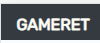

  

### Navigation
- Fully Responsive.
- On small screens switches to hamburger menu.
- Indicates login/logout in status.
- displayed on all pages.  
- User stories covered: 6, 7

See feature images

### Card Links
- Allows the user to easy access filtered sections. 
- User stories covered: 6, 12, 14, 15, 16

See feature image

### Footer
- Contains social media links, email subscription, privacy policy, and copyright.
- displayed on home page and about page 
- User stories covered: 6, 7

See feature images

  

### Mailing List Sign Up
- Mailchimp signup for email mailing list.  
- User stories covered: 30

See feature images

### Social Media Links
- An icon with a link is used for each social media displayed
- Each link opens in a new tab so the user has access to the website after being redirected
- displayed on home page and about page 
- User stories covered: 7

See feature images

### Sign up / Register
- Allow users to register an acoount.
- User stories covered: 1  

See feature image

### Sign In
- User can sign in.  
- User stories covered: 2

See feature images

### Sign Out
- Allows the user to securely sign out.
- Ask user if they are sure they want to sign out.  
- User stories covered: 2

See feature image

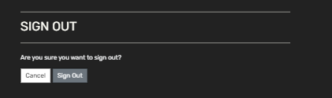

  

### Products View
- Allows the user to view all listed products. 
- User stories covered: 12, 14, 15, 16

See feature image

### Products detail 
- Allows the user to view details of a specific product. 
- User stories covered: 13, 17, 18, 19

See feature images

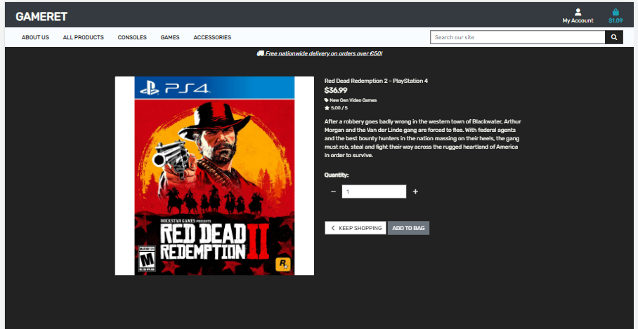

### Bag
- Allows the user to view the bag with their items. 
- User stories covered: 11, 26

See feature image

  

### Checkout View
- Allows user to purchase products.  
- User stories covered: 24

See feature image

 

### Edit Product Quantity
- Allows the user to edit their the product amount.  
- User stories covered: 25, 27

See feature image

  

### Remove Product From Bag
- Allows the user to remove a product from their bag.  
- User stories covered: 25, 27

See feature image

  

### Alert Box
- Allows the user to see relevant alerts.  
- User stories covered: 26

See feature image

   

### Sort
- Allows the user to sort the listed products.  
- User stories covered: 20, 21, 22, 23   

See feature images

  

### Search
- Allows the user to search for products.  
- User stories covered: 21

See feature image

  

### Stripe
- Allows the user to use stripe for card payments.  
- User stories covered: 24

See feature image

 

### Confirmation Details
- Allows the user to receive confirmation of purchase
- Full details are shown along with a message  
- User stories covered: 28

See feature image

  

### Email Confirmation
- Allows the user to receive an email confirmation for their order.  
- User stories covered: 29

See feature image

  

### Profile
- Allows the user to update their information and see their order history.  
- User stories covered: 5

See feature image

  

### Add Product
- Allows the Admin to add new products.  
- User stories covered: 30

See feature image

  

### Edit Product
- Allows the Admin to edit the products.  
- User stories covered: 31

See feature image

  

### Delete Product
- Allows the Admin to delete products, includes confirmation prompt before deletion.  
- User stories covered: 32

See feature image

### Contact message
- Users can send a message via the message form 
- User stories covered: 33 
  

See feature images

### Blog
- Allows user to view a list of blog articles 
- User stories covered: 36

See feature image

  

### Blog Details
- Allows user to view blog details 
- User stories covered: 36

See feature image

 

### Blog Comments
- Allows user to comment an a blog
- User stories covered: 37

See feature image

 

### Pagination
- Pagination is used on the products page
- Pagination is included in filtered and query search's 
- User stories covered: 6
  

See feature images

##### Back to [top](#table-of-contents)

# Validation  

## HTML Validation

The W3C Markup Validation Service was used to validate the HTML of the website.  

### Home  

- No Errors Found

index.html

 

| **Level** | **Feature** | **Issue Description** | **Comment** |
|-------------|-------------|----------------------|-------------|
| Error | N/A | N/A | N/A |
| Warning | N/A | N/A | N/A |

### Products  

- No Errors Found

products.html

 

| **Level** | **Feature** | **Issue Description** | **Comment** |
|-------------|-------------|----------------------|-------------|
| Error | N/A | N/A | N/A |
| Warning | N/A | N/A | N/A |  

### Product Detail  

- No Errors Found

product_detail.html

 

| **Level** | **Feature** | **Issue Description** | **Comment** |
|-------------|-------------|----------------------|-------------|
| Error | N/A | N/A | N/A |
| Warning | N/A | N/A | N/A |  

### Add Product

- No Errors Found

add_product.html

 

| **Level** | **Feature** | **Issue Description** | **Comment** |
|-------------|-------------|----------------------|-------------|
| Error | N/A | N/A | N/A |
| Warning | N/A | N/A | N/A | 
| Info | Edit Product | Trailing slash on void elements has no effect and interacts badly with unquoted attribute values. | Noted| 

### Edit Product

- No Errors Found
1 Info detected

edit_product.html

 

| **Level** | **Feature** | **Issue Description** | **Comment** |
|-------------|-------------|----------------------|-------------|
| Error | N/A | N/A | N/A |
| Warning | N/A | N/A | N/A | 
| Info | Edit Product | Trailing slash on void elements has no effect and interacts badly with unquoted attribute values. | Noted| 

### Bag  

- No Errors Found

bag.html

| **Level** | **Feature** | **Issue Description** | **Comment** |
|-------------|-------------|----------------------|-------------|
| Error | N/A | N/A | N/A |
| Warning | N/A | N/A | N/A |  

### Checkout  

- No Errors Found

checkout.html

| **Level** | **Feature** | **Issue Description** | **Comment** |
|-------------|-------------|----------------------|-------------|
| Error | N/A | N/A | N/A |
| Warning | N/A | N/A | N/A |  

### Checkout Success  

- No Errors Found

checkout_success.html

| **Level** | **Feature** | **Issue Description** | **Comment** |
|-------------|-------------|----------------------|-------------|
| Error | N/A | N/A | N/A |
| Warning | N/A | N/A | N/A | 

### Profile  

- No Errors Found

profile.html

| **Level** | **Feature** | **Issue Description** | **Comment** |
|-------------|-------------|----------------------|-------------|
| Error | N/A | N/A | N/A |
| Warning | N/A | N/A | N/A | 
| Info | Edit Product | Trailing slash on void elements has no effect and interacts badly with unquoted attribute values. | Noted| 

### About 

- No Errors Found

about.html

| **Level** | **Feature** | **Issue Description** | **Comment** |
|-------------|-------------|----------------------|-------------|
| Error | N/A | N/A | N/A |
| Warning | N/A | N/A | N/A |

### Blog 

- No Errors Found

blog.html

 

| **Level** | **Feature** | **Issue Description** | **Comment** |
|-------------|-------------|----------------------|-------------|
| Error | N/A | N/A | N/A |
| Warning | N/A | N/A | N/A |

### Blog Details

- No Errors Found

blog_details.html

 

| **Level** | **Feature** | **Issue Description** | **Comment** |
|-------------|-------------|----------------------|-------------|
| Error | N/A | N/A | N/A |
| Warning | N/A | N/A | N/A |

### Sign In 

- No Errors Found

login.html

| **Level** | **Feature** | **Issue Description** | **Comment** |
|-------------|-------------|----------------------|-------------|
| Error | N/A | N/A | N/A |
| Warning | N/A | N/A | N/A |  

### Sign Out  

- No Errors Found

logout.html

 

| **Level** | **Feature** | **Issue Description** | **Comment** |
|-------------|-------------|----------------------|-------------|
| Error | N/A | N/A | N/A |
| Warning | N/A | N/A | N/A | 

### Register  

- No Errors Found

signup.html

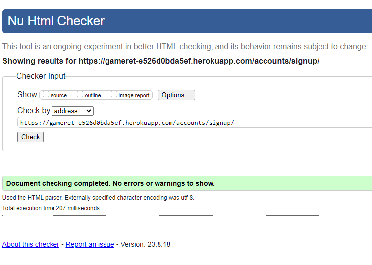

 

| **Level** | **Feature** | **Issue Description** | **Comment** |
|-------------|-------------|----------------------|-------------|
| Error | N/A | N/A | N/A |
| Warning | N/A | N/A | N/A |  

### 404  

- No Errors Found

404.html

 

| **Level** | **Feature** | **Issue Description** | **Comment** |
|-------------|-------------|----------------------|-------------|
| Error | N/A | N/A | N/A |
| Warning | N/A | N/A | N/A |  

##### Back to [top](#table-of-contents)
  

### CSS Validation
The W3C Jigsaw CSS Validation Service was used to validate the CSS of the website.

base.css

 

about.css

profile.css

 

checkout.css

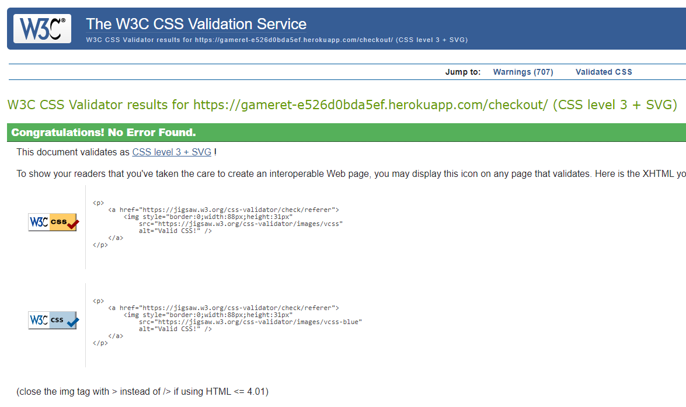

 

### JavaScript Validation
JSHint javaScript Validation Service was used to validate all javaScript files.

stripe_elements.js

 

- No issues raised 

countryfield.js

 

- No issues raised  

## PEP8 Validation
[CI Python Linter](https://pep8ci.herokuapp.com/) was used to check the code for PEP8 requirements.

About

admin.py

 

forms.py

 

models.py

urls.py

views.py

Bag

Contexts.py

urls.py

views.py

Blog

admin.py

forms.py

models.py

urls.py

views.py

test_models.py

Checkout

admin.py

apps.py

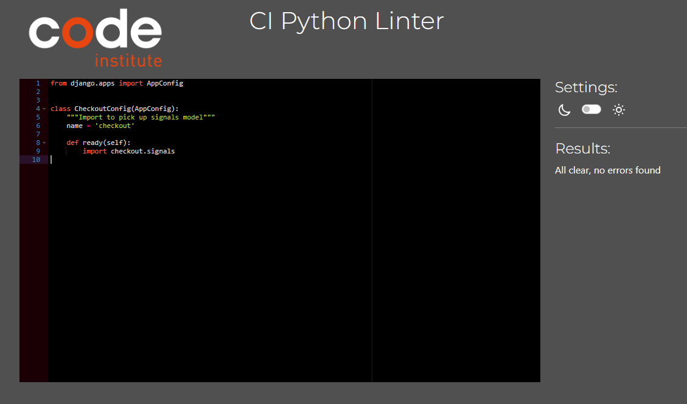

forms.py

models.py

signals.py

urls.py

views.py

webhook_handler.py

webhook.py

gameret

asgi.py

settings.py

urls.py

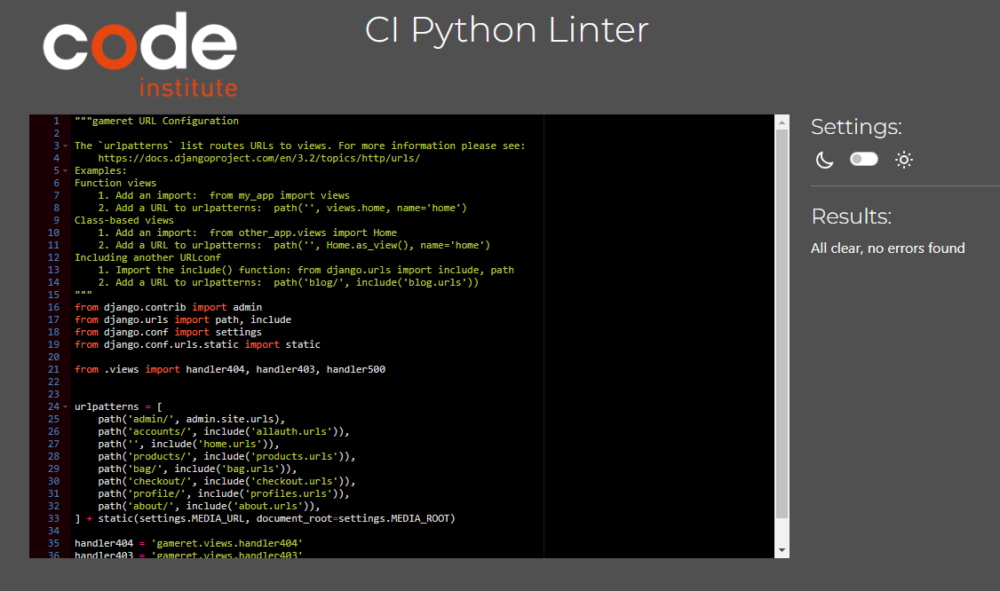

views.py

wsgi.py

home

urls.py

views.py

products

admin.py

forms.py

models.py

urls.py

views.py

widgets.py

profiles

forms.py

models.py

urls.py

views.py

root

custom_storages.py

  

##### Back to [top](#table-of-contents)
  

## Accessibility  
The [WAVE WebAIM web accessibility evaluation tool](https://wave.webaim.org/) was used to ensure the website met high accessibility standards.  
- All pages returned 0 errors.  
- All alerts presented were for redundant links which were taken into account during developmentt.

Home

Product List

Product details

Add Product

Edit Product

Bag

Checkout

Checkout Success

About

 

Blog

 

Blog Details

 

Profile

 

Sign Up

Sign In

Sign Out

 

404

  

## Lighthouse

Performance, best practices and SEO was tested using Lighthouse.

#### Desktop

Home

Product List

Product details

Add Product

Edit Product

Bag

Checkout

Checkout Success

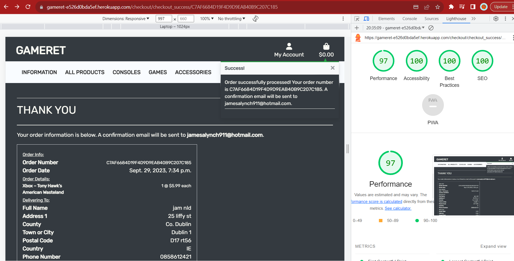

About

Blog

Blog Details

Profile

 

Sign Up

Sign In

Sign Out

 

## Testing

1. Manual testing User Stories
2. Automated testing

### Manual testing

1.	As a Shopper / Site User I can register for an account so that I can have an account and view my profile

| Feature | Action | Expected Result | Actual Result |
| ------- | ------ | --------------- | ------------- |
| Sign Up | Click pofile button and select register, user is brought to the sign up page| User is brought to the sign up page | Works as expected  

See Images

  

2.	As a Shopper / Site User I can login and logout so that I can have an account with my information stored for fast usage  

| Feature | Action | Expected Result | Actual Result |
| ------- | ------ | --------------- | ------------- |
| Sign In | Click pofile button and select login, user is brought to the sign in page | User is brought to the sign in page | Works as expected  

See Images

  

3.	As a Shopper / Site User I can recover my password so that I can set a new password if I forgot it 

| Feature | Action | Expected Result | Actual Result |
| ------- | ------ | --------------- | ------------- |
| Reset Password | Click pofile button and select login, user is brought to the sign in page, click forgot password to go to password reset page | User is brought to password reset page | Works as expected  

See Images

   

4.	As a Shopper / Site User I can receive an email confirmation after registration so that I can be notified registration was successful  

| Feature | Action | Expected Result | Actual Result |
| ------- | ------ | --------------- | ------------- |
| Registration Confirmation| Upon registration an email is sent to verify the email address submitted | Registration email arrives into inbox of the email address used to sign up | Works as expected  

See Images

  

5.	As a Shopper / Site User I can have a profile so that I can store my information for faster checkouts in the future  

| Feature | Action | Expected Result | Actual Result |
| ------- | ------ | --------------- | ------------- |
| Profile | From the Nav click the profile icon, select My Profile from dropdown and be brought to the profile page where user information is stored | Be brought to profile page | Works as expected  

See Images

   

6.	As a Shopper / Site User I can navigate across the site so that I can can access all parts of the site  

| Feature | Action | Expected Result | Actual Result |
| ------- | ------ | --------------- | ------------- |
| Navbar | Click on any link in the navbar to be brought to a relevant page, shop for example | Be brought to relevant page after clicking an icon in the navbar | Works as expected  

See Images

   

7.	As a Shopper / Site User I can use a navbar, footer, and social icons so that I can navigate the site, access menus, and access socials 

| Feature | Action | Expected Result | Actual Result |
| ------- | ------ | --------------- | ------------- |
| Navbar/Footer | Scoll to footer, click on the Instagram logo | A new tab will open and bring user to the twitter home page | Works as expected  

See Images

   

8.	As a Shopper / Site User I can be notified of my actions so that I can be aware the action was completed successfully or not  

| Feature | Action | Expected Result | Actual Result |
| ------- | ------ | --------------- | ------------- |
| Message Alert | Add an item from the shop to the bag | A message will appear in the alert box on screen to notify the user of this action | Works as expected  

See Images

  

9.	As a Shopper / Site User I can see my login status so that I can know if I am logged in or not  

| Feature | Action | Expected Result | Actual Result |
| ------- | ------ | --------------- | ------------- |
| Login Status | While logged out the profile icon in the navbar will be gray, log in it will change to a light blue color | Once logged in the profile icon will be light blue | Works as expected  

See Images

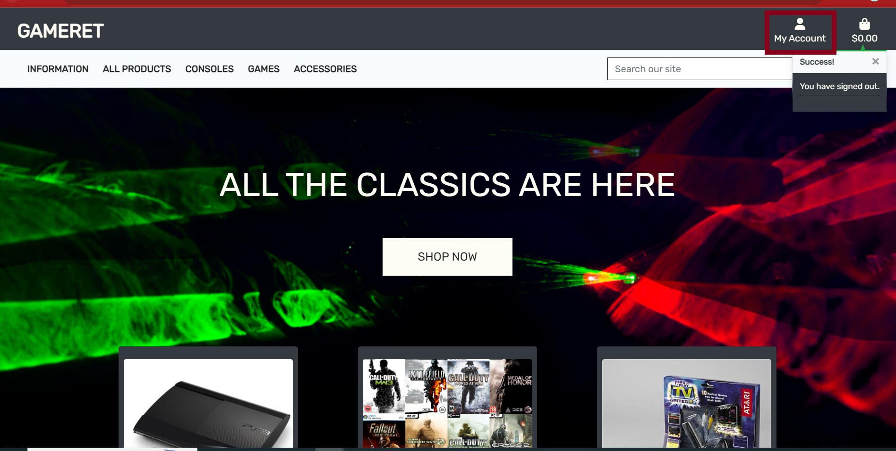

  

10.	As a Shopper / Site User I can visit the shop so that I can view all products available  

| Feature | Action | Expected Result | Actual Result |
| ------- | ------ | --------------- | ------------- |
| Shop | Click shop in the navbar, select all products | User is then brought to the all products page of the shop | Works as expected  

See Images

  

11.	As a Shopper / Site User I can view my basket and total cost at any time so that I can be aware of what I am buying and it's cost 

| Feature | Action | Expected Result | Actual Result |
| ------- | ------ | --------------- | ------------- |
| Bag | Click the Bag icon in the navbar | User is brought to the bag page where all products in Bag are displayed along with their price and total cost | Works as expected  

See Images

  

12.	As a Shopper / Site User I can view a list of products so that I can select a product to purchase  

| Feature | Action | Expected Result | Actual Result |
| ------- | ------ | --------------- | ------------- |
| Categories List | Select a category on the side panel, select Playstaion from the dropdown |  User is brought to the selected category of product and all products are listed | Works as expected  

See Images

   

13.	As a Shopper / Site User I can view an individual product details so that I can view a more detailed view of the product  

| Feature | Action | Expected Result | Actual Result |
| ------- | ------ | --------------- | ------------- |
| Product Detail | Click on any item image in the shop, or the view button |  User is borught to the product detail page where product details are displayed | Works as expected  

See Images

  

14.	As a Shopper / Site User I can view a list of Consoles so that I can select a console I want to purchase  

| Feature | Action | Expected Result | Actual Result |
| ------- | ------ | --------------- | ------------- |
| Consoles List |  From the navbar click the All Consoles selection | User is brought to the Consoles List page | Works as expected  

See Images

  

15.	As a Shopper / Site User I can view a list of Games so that I can select a game I want to purchase  

| Feature | Action | Expected Result | Actual Result |
| ------- | ------ | --------------- | ------------- |
| Games List |  From the navbar click the All Games selection | User is brought to the Games List page | Works as expected

See Images

 

16.	As a Shopper / Site User I can view a list of Accessories so that I can select an accessory I want to purchase  

| Feature | Action | Expected Result | Actual Result |
| ------- | ------ | --------------- | ------------- |
| Accessories List |  From the navbar click the All Accessories selection | User is brought to the Accessories List page | Works as expected

See Images

  

17.	As a Shopper / Site User I can view a individual Consoles so that I can see more detailed information about it 
 
| Feature | Action | Expected Result | Actual Result |
| ------- | ------ | --------------- | ------------- |
| Console View | Select a Console from the Console products page | All items with the relevant details will be displayed | Works as expected  

See Images

  

18.	As a Shopper / Site User I can view a individual Game so that I can see more detailed information about it  

| Feature | Action | Expected Result | Actual Result |
| ------- | ------ | --------------- | ------------- |
| Game View | Select a Game from the Games products page | All items with the relevant details will be displayed | Works as expected

See Images

  

19.	As a Shopper / Site User I can view individual accessorie so that I can see more detailed information about it  

| Feature | Action | Expected Result | Actual Result |
| ------- | ------ | --------------- | ------------- |
| Accessories View | Select a Accessorie from the Accessorie products page | All items with the relevant details will be displayed | Works as expected
  

See Images

  

20.	As a Shopper / Site User I can search for a product by name or description so that I can find a certain product 
 
| Feature | Action | Expected Result | Actual Result |
| ------- | ------ | --------------- | ------------- |
| Search | Enter a Catagorie name into search bar and select search | All items matching your request will be displayed | Works as expected  

See Images

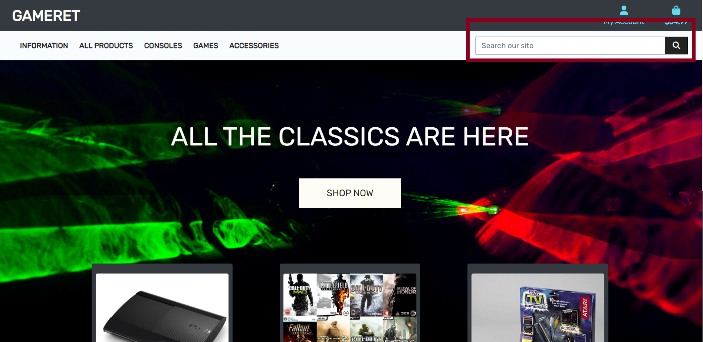

  

21.	As a Shopper / Site User I can see my search results so that I can only see what I am searching for  

| Feature | Action | Expected Result | Actual Result |
| ------- | ------ | --------------- | ------------- |
| Search View | Enter any request into search bar and select search | All items matching your request will be displayed | Works as expected 

See Images

  

22.	As a Shopper / Site User I can sort by price low to high and high to low so that I can view products according to my budget  

| Feature | Action | Expected Result | Actual Result |
| ------- | ------ | --------------- | ------------- |
| Search Price | From any products page, select Price | Organsies products in the requested fashion | Works as expected  

See Images

  

23.	As a Shopper / Site User I can use a card as the payment method so that I can complete my purchase  

| Feature | Action | Expected Result | Actual Result |
| ------- | ------ | --------------- | ------------- |
| Payment Method | From the basket select secure checkout | Input user information, input card number 4242 4242 4242 4242 04/24 424 24242, payment is successful | Works as expected  

See Images

  

24.	As a Shopper / Site User I can select the quantity of a product so that I can select a quantity that suites my needs 

| Feature | Action | Expected Result | Actual Result |
| ------- | ------ | --------------- | ------------- |
| Quantity Selection | From the products detail page, increase/ decrease button to desired number, click add to bag | The basket will update with the desired quantity | Works as expected    

See Images

  

25.	As a Shopper / Site User I can view items in my basket so that I can be aware of what I am buying and it's cost 

| Feature | Action | Expected Result | Actual Result |
| ------- | ------ | --------------- | ------------- |
| Bag View | Click the Bag icon in the navbar | The basket page will appear and display all items in the basket and their cost alongside total price for all items | Works as expected 

See Images

  

26.	As a Shopper / Site User I can adjust item quantity in my basket so that I can increase or reduce item count according to my needs  

| Feature | Action | Expected Result | Actual Result |
| ------- | ------ | --------------- | ------------- |
| Bag Quanity | Click the Bag icon in the navbar, increase/ decrease button to desired number and then click update | The product quantiy request will be updated | Works as expected 

See Images

  

27.	As a Shopper / Site User I can receive order confirmation so that I can be notified of a successful order  

| Feature | Action | Expected Result | Actual Result |
| ------- | ------ | --------------- | ------------- |
| Order Confirmation | Successfully complete a checkout | Confirmation details are displayed | Works as expected  

See Images

  

28.	As a Shopper / Site User I can receive email confirmation so that I can have a record of my purchase  

| Feature | Action | Expected Result | Actual Result |
| ------- | ------ | --------------- | ------------- |
| Email Order Confirmation | Upon a successful checkout a confirmation email will be sent to the provided email address which contains the details of the order | Email confirmation arrives into inbox | Works as expected  

See Images

 

29.	As a Store Owner / Admin I can add a product so that I can add new products to the shop  

| Feature | Action | Expected Result | Actual Result |
| ------- | ------ | --------------- | ------------- |
| Add Product | Select the Product Management as an admin account | Add Product details are displayed | Works as expected  

See Images

  

30.	As a Store Owner / Admin I can edit a product so that I can edit existing products in the shop  

| Feature | Action | Expected Result | Actual Result |
| ------- | ------ | --------------- | ------------- |
| Edit Product | From product detail as an admin account, find a edit button on the page, click edit | Admin is brought to the edit product page where they can adjust any part of the product | Works as expected 

See Images

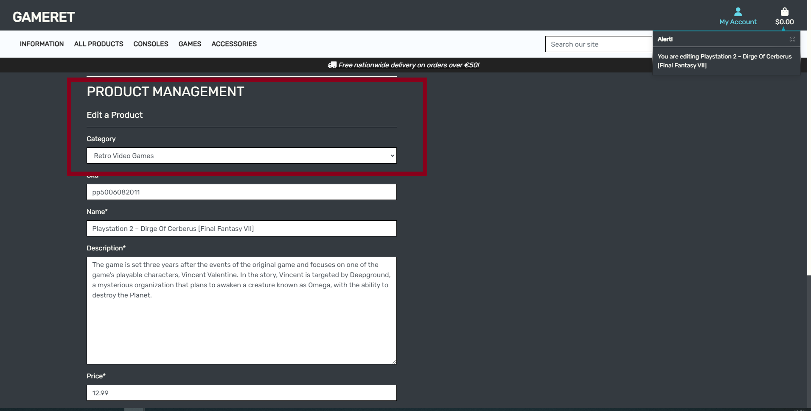

   

31.	As a Store Owner / Admin I can delete a product so that I can delete existing products from the shop 

| Feature | Action | Expected Result | Actual Result |
| ------- | ------ | --------------- | ------------- |
| Delete Product  | From product detail as an admin account, find a delete button on the page, click delete | A modal pops up and asks the admin to confirm they wish to delete the product | Works as expected |   

See Images

  

32.	As a Shopper / Site User I can Sort products in alphabetical order so that I can search products by letter  

| Feature | Action | Expected Result | Actual Result |
| ------- | ------ | --------------- | ------------- |
| Search Alphabetical | From any products page, select Name(A-Z) | Organsies products alphabetical| Works as expected  

See Images

   

33.	As a Store Owner / Admin I can view messages sent in by public so that I can gather feedback and converse its with its community  

| Feature | Action | Expected Result | Actual Result |
| ------- | ------ | --------------- | ------------- |
| Message View | Log into admin panal and select Contacts from the About setion | All messages recieved are listed | Works as expected  

See Images

 

34.	As a Site User I can recover my password so that I can set a new password if I forgot it

| Feature | Action | Expected Result | Actual Result |
| ------- | ------ | --------------- | ------------- |
| Password Recovery | Select Forgot Password from the sign in section, fill in required details and a email will be sent containg a link to Change Password | Password Changed | Works as expected |  

See Images

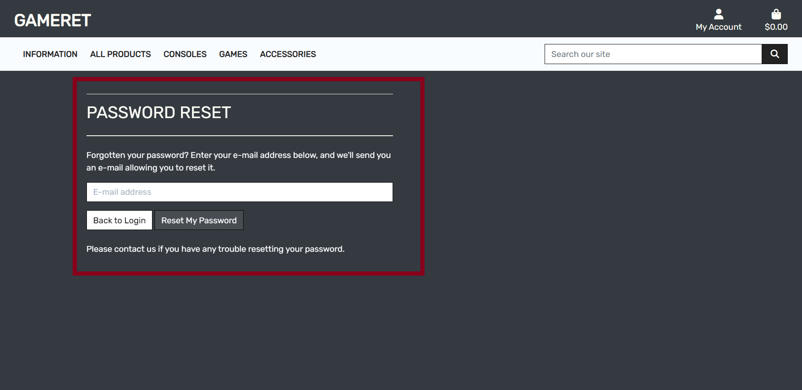

 

35.	As a Shopper / Site User I can subscribe to a newsletter so that I can Keep updated with the latest new from the store 

| Feature | Action | Expected Result | Actual Result |
| ------- | ------ | --------------- | ------------- |
| Email Subscription | Fill in the Subscription input in the footer | A message alert will appear and email confirmation will be sent confirming subscription | Works as expected |  

See Images

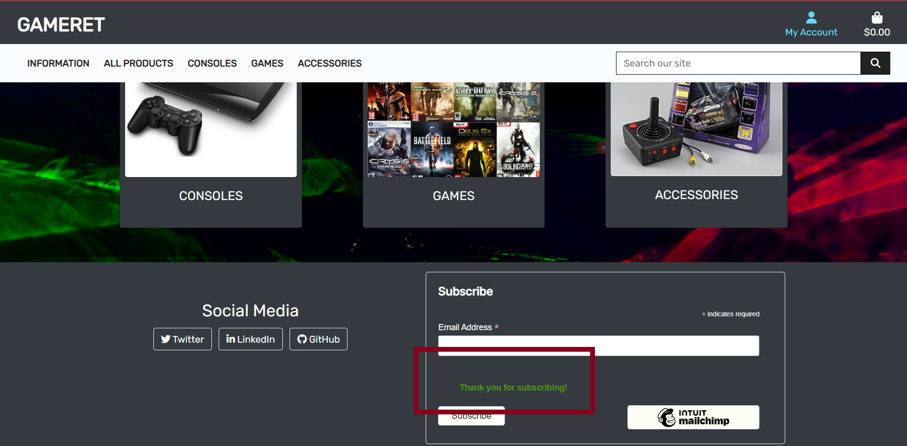

 

### Automated testing

- Testing was done using the built in Django module, unittest.
- Coverage was also usesd to generate a report

 About, test_forms.py

 

 About, test_models.py

 

 About, test_views.py

 

 Bag, test_views.py

 

 Blog, test_views.py

 

 Checkout, test_forms.py

 

 Checkout, test_models.py

 

 Checkout, test_views.py

 

 Products, test_models.py

 

 Products, test_views.py

 

### Coverage  
A Python test plugin called coverage was used to generate the following results and display how much of the code was covered by the unittest module.

Coverage

 

### Device Testing
The website was tested on the following devices:
- HP Pavilion laptop
- Smasung S21+
- Ipad (8th Generation)
- Iphone 12 Pro

### Browser Compatibility
The website was tested on the following browsers:
- Google Chrome
- Microsoft Egde
- Apple Safari

##### Back to [top](#table-of-contents)

## Bugs

| **Bug** | **Fix** |
| ------- | ------- |
| Accessibility Validation for image field in add product view  | Added alt tag to custom clearable file input widget file|
| Pagination for filtered querys returnig all products on 2nd page | Altered links in html and added page filter into templatetags |
| Prompt not displaying when deleting product | Added javascript to target the ID of the element to resolve this |
| Contact form showing 404 when sent | Updated migrations and updated workspace variables |
| Confirmation eamil showing default message | Updated domain name in django admin |

##### Back to [top](#table-of-contents)

## Deployment

### AWS S3 Bucket Setup  

To set up an AWS S3 bucket:

1. Log into the AWS Management Console and select the Amazon S3 console.  

2. Click on the "Create Bucket" button.  

3. Enter a unique name for your bucket and select the region where you want the bucket to be located.

4. Configure any additional options, such as versioning, object-level logging, and object tagging, as needed.  

5. Click on the "Create" button to create the bucket.

6. Set up the appropriate permissions for the bucket, such as access control lists (ACLs) and bucket policies, to control who can access the data in the bucket.  

7. Upload files to the bucket using the AWS S3 console, the AWS S3 CLI, or the AWS S3 SDK.  

8. Access your files through the AWS S3 Console, AWS S3 CLI, or the AWS S3 SDK.  

### Creating a Database

1. To generate a managed PostgreSQL database,  visit the [ElephantSQL](https://customer.elephantsql.com/ ) website  and either create a new account or log in to your existing account. After successfully logging in, follow the steps below to proceed with generating the database
2. Navigate to the dashboard or homepage of your ElephantSQL account.
click on the 'Create New Instance' button

3. Name your database and select the 'Tiny Turtle' payment plan. Then, click on 'Select Region'

4.  Select your preferred region and create the database instance.
After creating the instance, navigate to the instances page and click on the name of the database you selected earlier. Then, in the details section on the following page, copy the PostgreSQL URL.

5. Copy database Url cause its needed for heroku:

### Stripe payment gateway

1. Create an account or login  to  [Stripe](https://dashboard.stripe.com/)
Navigate to home tab

2. under developers section copy the values of:
 `SECRET_KEY ` and `PUBLIC_KEY`

3. Navigate to developer section of stripe dashboard
and Click on the `webhooks` tab to add an endpoint

4. Create a webhook with url of deployed project in this format
https://yourwebsite.com/checkout/wh/

5. Choose events the webhook will receive(payment intent events) and
add endpoint

6. Ensure your webhook is working by doing test with various events

7. Add those keys as env variables to your env.py file and settings.py file while later those values will be needed for heroku deployment
        

### Heroku Deployment

* This site was deployed by completing the following steps:

1. Log in to [Heroku](https://id.heroku.com) or create an account

View Image

 

2. On the main page click the "New" in the top right corner and select Create New App from the drop dwon menu

View Image

 

3. No name can be duplicated so choose an original title

View Image

 

4. Choose the region where you are based

View Image

 

5. Click the create new app input

View Image

 

6. Choose the settings Tab then select config vars to enter in values

View Image

 

7. Click Reveal Config Vars and ensure the following environment variables are set in Heroku

View Image

8. Next, scroll down to the Buildpack section click Add Buildpack select python and click Save Changes

View Image

9. Click add buildpacks and selct heroku/python and node.js(Must be in this order, they can be clicked and dragged if they need to be changed)

View Image

10. Next select the deploy tab near the top of the page

View Image

11. Choose Github as the deployment method

View Image

12. Select the repository name and then the connect button

View Image

13. At the bottom of the deploy page, select the preferred deployment type (Enable Automatic Deploys for automatic deployment or deploy from branch to push the deployment manually)

View Image

### Forking This Project

* Fork this project by following the steps:
You can for fork the repository by following these steps:
1. From the GitHub repository

2. Click the Fork button on the upper right hand corner

### Cloning This Project

* You can clone the repository by following these steps:
1. From the GitHub repository 

2. Select the Code button on top of the list of files

3. Choose your prefeared option to clone HTTPS, SSH, or Github CLI. Select the copy button to copy the URL to your clipboard

4. Open Git Bash and edit the current working directory to the one where you want the copied directory

5. Type git clone and paste in URL that you copied ($ git clone https://github.com/YOUR-USERNAME/YOUR-REPOSITORY)

6. Next click enter and you will have your local clone

## Credits

### Media
Images used can be found at:
- [Pexels](https://www.pexels.com/)
- [Amazon](https://www.amazon.co.uk/)

Blog Posts can be found at:
- [Playstion](https://blog.playstation.com/)
- [Xbox](https://news.xbox.com/en-us/)
- [Retro Gamer](https://www.retrogamer.net/category/blog_post/)

### Code

- The inital code was adapted from lessons taught by Code Institute's, program, tutor's, menotor's, fellow students and it's Slack Channels : [Code Institute : Home Page](https://codeinstitute.net/ie/full-stack-software-development-diploma/?utm_term=code%20institute&utm_campaign=CI+-+IRL+-+Search+-+Brand&utm_source=adwords&utm_medium=ppc&hsa_acc=8983321581&hsa_cam=14304747355&hsa_grp=128775288209&hsa_ad=635725005315&hsa_src=g&hsa_tgt=kwd-319867646331&hsa_kw=code%20institute&hsa_mt=e&hsa_net=adwords&hsa_ver=3&gad=1&gclid=Cj0KCQjwnf-kBhCnARIsAFlg491o7ee6Cfv20TwyLD9KWyi47xYkCWKMp3_EWqWQl8eaGV1AWRGDvgEaAnHjEALw_wcB)

## Acknowledgements
I would like to thank:
- My mentor Mo Shami for his feedback and helpful advice
- To Code Institute for their helpful and informative guidance

##### Back to [top](#table-of-contents)
 

